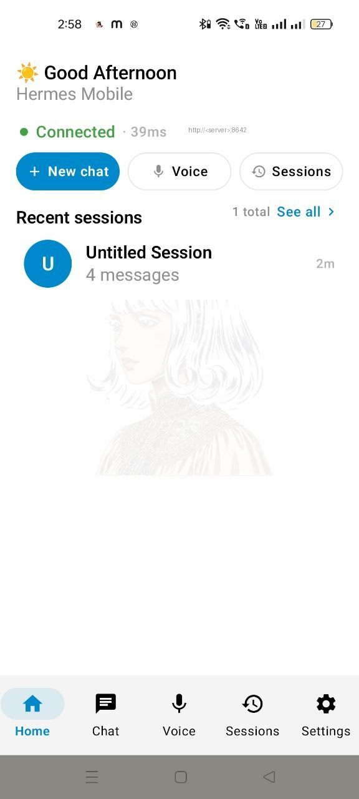
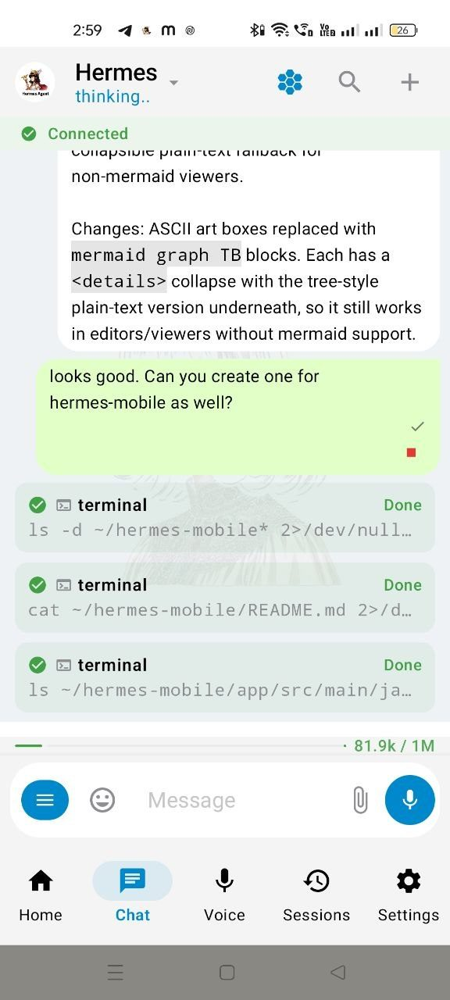
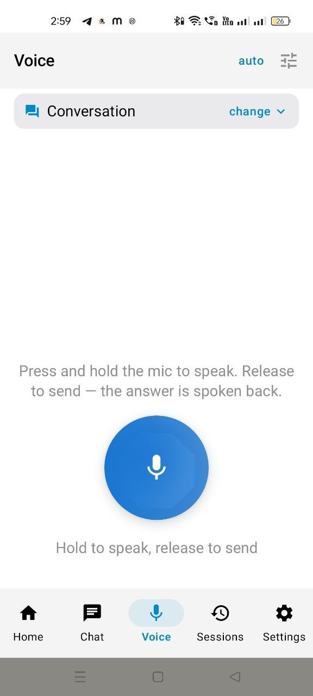
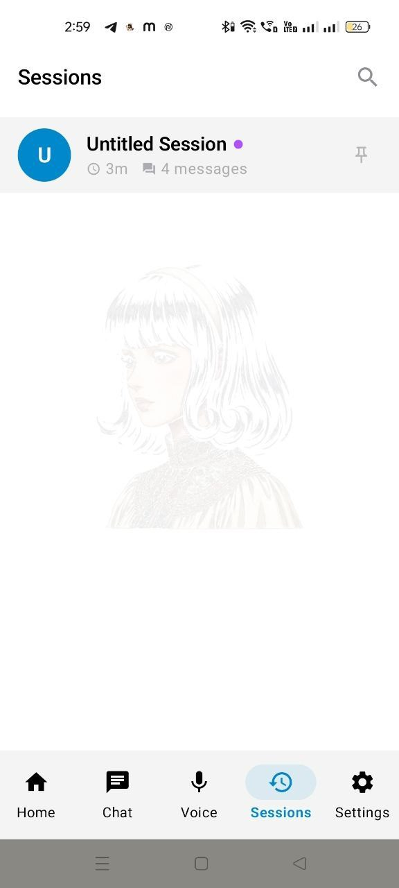
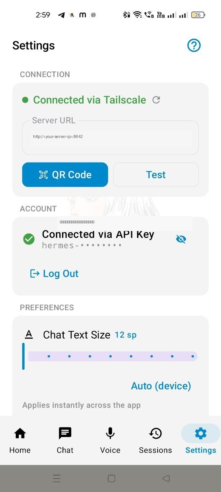
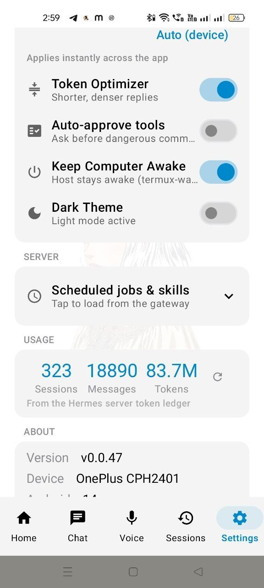

# Hermes Mobile

<p align="center">
  
  
  
  
</p>

Your Hermes Agent, in your pocket. A native Android app that connects **directly to the gateway
running on your own computer or phone** (default port 8642) — chat, voice, files, and full server
management from anywhere on your network or over Tailscale. No cloud relay, no bridge server, no
app accounts: your agent, your machine, your key.

Pairs in one QR scan. Works with any Hermes Agent install — Windows, macOS, Linux, Termux.

## See it first

| Home — status & recents | Chat — streaming + files | Voice — press to talk |
|---|---|---|
|  |  |  |

| Sessions — all platforms | Settings — QR pairing | Usage & preferences |
|---|---|---|
|  |  |  |

## Features

### 💬 Chat, done right
- **Streaming replies** with Markdown + syntax-highlighted code, Telegram-style UX
- **Per-session model picker** — every model your server has, listed live (zero hardcoded
  models), with a Global toggle to set it server-wide; your choice sticks per session
- **Slash commands** (`/new`, `/stop`, `/model`…) with a type-to-filter sheet, built from your
  actual server commands
- **Retry any message** from its menu; long turns keep running server-side even if you leave
  the screen — come back and everything is already there
- **Context meter** above the input: live tokens used / window, straight from server truth

### 📁 Files
- Send photos/documents to your agent; receive its output as **downloadable file cards**
- In-app previews: images, multi-page PDF, Office docs, JSON/code — with safe fallback and
  "Open externally" for anything else
- One-tap **save to device** on every attachment

### 🎤 Voice
- **Press to talk** (Whisper STT on your server), replies spoken back (TTS)

### 🗂 Sessions
- Every session from every platform — Telegram, CLI, desktop, this app — searchable, switchable,
  deletable; usage stats come from the server, not estimates

### ⚙️ You own the server — from the phone
- **Settings:** connection card (URL/key/test, QR scan **camera or gallery**), chat text size,
  Token Optimizer (shorter replies), auto-approve tools, keep computer awake, dark theme
- **About:** app + agent versions with an update check that can actually **update Hermes Agent
  and restart the gateway** — remotely
- Crash reports upload themselves on next launch; "Share logs" ships the buffer

## Get started (3 steps)

1. On your computer: install [Hermes Agent](https://hermes-agent.nousresearch.com), then
   [`hermes-mobile-plugin`](https://github.com/tawaresachin/hermes-mobile-plugin) —
   `pip install git+https://github.com/tawaresachin/hermes-mobile-plugin && hermes-mobile-plugin install` prints a QR.
2. On your phone: install the latest
   [Hermes Mobile APK](https://github.com/tawaresachin/hermes-mobile/releases).
3. App → Settings → **Connect with QR** → scan. URL, API key, and connection test configure
   themselves.

Different network? Put both devices on [Tailscale](https://tailscale.com) (or any tunnel) — the
QR carries the address your phone can reach.

## Requirements

- Hermes Agent with `hermes-mobile-plugin` installed, gateway running (api_server, port 8642)
- Android 8.0+ (minSdk 26). Phone and server network-reachable (LAN / Tailscale / tunnel)

## Build from source

```bash
./gradlew :app:assembleDebug        # APK → app/build/outputs/apk/debug/
./gradlew :app:testDebugUnitTest    # 62 unit tests
```

JDK 17+, Android SDK 35, Kotlin + Jetpack Compose (Material 3). Architecture: single Activity,
MVVM, OkHttp + SSE to the gateway; Room cache; no third-party backend.

## Versioning & releases

App and plugin are separate products with independent versions.
[`scripts/release.sh`](scripts/release.sh) is the only sanctioned bump path: it sets
`versionName` + derived `versionCode` (or the plugin's `plugin.yaml`/`pyproject.toml`), tags
`vX.Y.Z` on the right repos, pushes, syncs the deployed plugin copy, and verifies the whole
contract (`scripts/check_versions.sh`, also installed as a pre-commit hook).

```bash
./scripts/release.sh 0.0.48           # app only
./scripts/release.sh none 0.0.7       # plugin only
```

## Troubleshooting

| Symptom | Fix |
|---|---|
| QR scan says unreachable | Same Wi-Fi/Tailscale? Settings → Test; regenerate QR on the server with `hermes-mobile-plugin qr` |
| Files preview blank | Update the plugin (restart gateway after); tap ⋯ → Open externally |
| Connected but voice fails | Check the agent's STT/TTS providers work on the server first |
| App crashed | Relaunch (it self-reports); Settings → About → Share logs |

## License

MIT © 2026 Sachin Taware — see [LICENSE](LICENSE).
